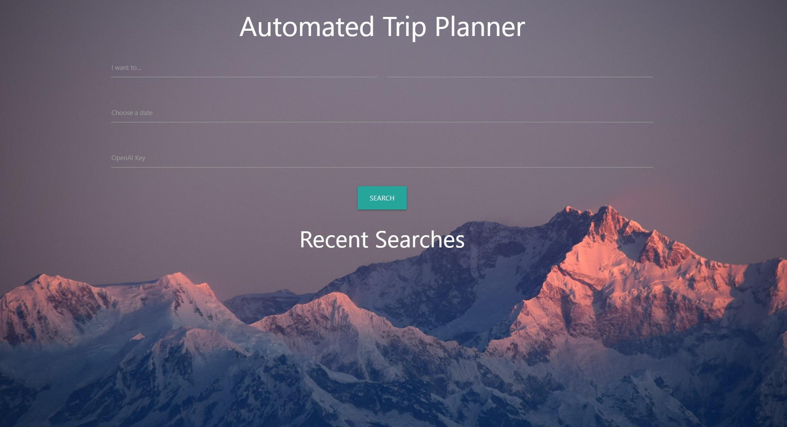
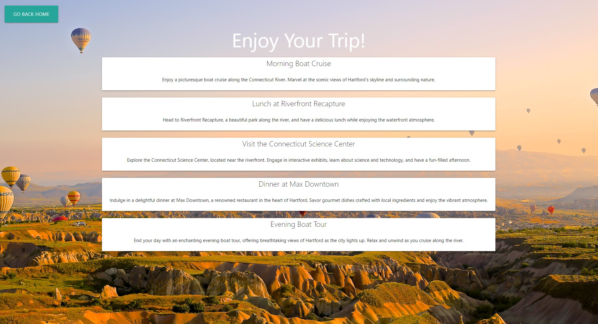
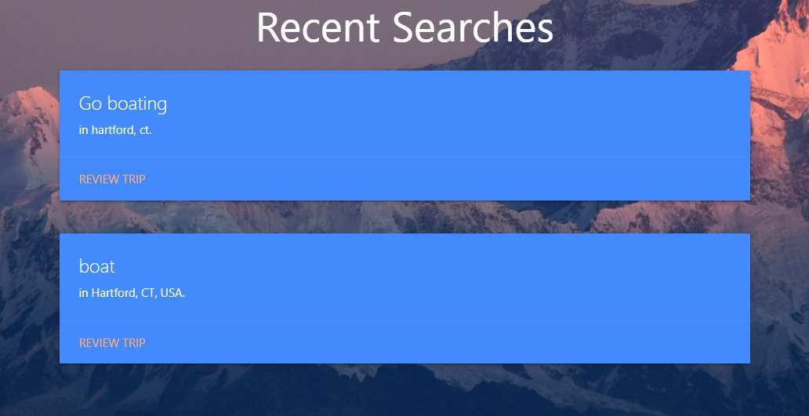

# Trip Planner

## Description

This app is a traveler's companion app. It will help set an itinerary for a selected date, activity preference, and location based on input values given to it by the user. This helps the average traveler make a travel plan when visiting a potentially new area or exploring more around them. It is powered by ChatGPT to get ai recommendations.

The inspiration was a recent trip one of our group member's took to New York, where he found himself googling, "best things to do in nyc, best places to eat in nyc, etc." Harnessing the power of AI was a was to automate the solution to this problem.

We learned about:

- Sending headers and API keys to an api endpoint
- A new css library (materialize)
- Best practice git workflows with a group.
- Improved our general coding ability through a challenging project.

## Technologies Used

- HTML

- CSS

  - [Materialize CSS](https://materializecss.com/)

- Javascript

  - [DayJS Library](https://day.js.org/en/)
  - [Materialize JS Components](https://materializecss.com/modals.html)

- APIs

  - [Google Places Autocomplete API](https://developers.google.com/maps/documentation/places/web-service/autocomplete)
  - [GPT OpenAI Chat completion API](https://platform.openai.com/docs/guides/gpt)

## Setup

You will need to obtain an OpenAi Api Key. You can obtain one from signing up on the [OpenAi Website](https://openai.com/blog/openai-api). This is the only required setup step.

## Usage

You can access the website with this [link](https://dakotablanchard.github.io/trip-planner/).

This is the home screen, where you can input what you want to day, the destination, date, and your [OpenAi Key](https://openai.com/blog/openai-api):

Once you enter your info, you will go through a loading screen, and then be redirected to your itinerary for the day:

You can click "Go Back Home" at the top left, to be redirected back to the home page. Here, you will see your three most recent searches as well. Clicking "Review Trip" on them will allow to you see the itinerary again:

## Credits

- [Normalize.css](https://necolas.github.io/normalize.css/)
- [UUID Generator Snippet](https://www.w3resource.com/javascript-exercises/javascript-math-exercise-23.php)
- [How to remove browser autofill background color](https://stackoverflow.com/questions/2781549/removing-input-background-colour-for-chrome-autocomplete)
- [How to remove spaces from a string](https://stackoverflow.com/questions/5963182/how-to-remove-spaces-from-a-string-using-javascript)
- [How to remove the last word in a string](<https://stackoverflow.com/questions/9323182/how-to-remove-the-last-word-in-a-string-using-javascript#:~:text=Use%3A,substring(0%2C%20lastIndex)%3B>)
- [Using OpenAi Endpoint](https://platform.openai.com/docs/api-reference/chat/create)

## License

This repo is available under the rules of the MIT License available [here](./LICENSE).

---
